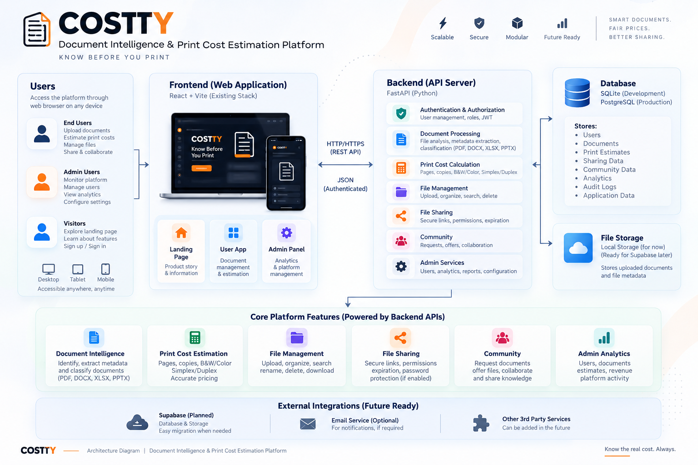

# COSTTY

A full-stack document management platform with print cost estimation, file sharing, and community features.



## Tech Stack

- **Frontend:** React 19 + TypeScript + Vite + TailwindCSS
- **Backend:** FastAPI (Python 3.11+) + SQLAlchemy 2.0
- **Database:** Supabase (PostgreSQL)
- **Storage:** Supabase Storage (or local filesystem)
- **Auth:** JWT (HS256)

## Project Structure

```
file_2/
├── backend/                  FastAPI backend
│   ├── app/
│   │   ├── api/             API route handlers
│   │   ├── core/            Config, database, storage
│   │   ├── models/          SQLAlchemy ORM models
│   │   ├── repositories/    Data access layer
│   │   ├── schemas/         Pydantic schemas
│   │   ├── services/        Business logic
│   │   └── main.py          FastAPI app entrypoint
│   ├── alembic/             Database migrations
│   ├── supabase/
│   │   └── migrations/      Supabase SQL migrations
│   ├── tests/               Pytest test suite
│   ├── scripts/             Utility scripts
│   ├── .env.example         Environment config template
│   └── requirements.txt     Python dependencies
│
├── frontend/                React + Vite frontend
│   ├── src/
│   │   ├── components/      Reusable UI components
│   │   ├── pages/           Page components (user + admin)
│   │   ├── services/        API service modules
│   │   ├── lib/             API client, contexts
│   │   ├── hooks/           Custom React hooks
│   │   ├── layouts/         Shell layouts
│   │   ├── utils/           Utility functions
│   │   └── types/           TypeScript types
│   ├── .env.example         Environment config template
│   └── package.json         Node dependencies
│
└── README.md                This file
```

## Features

- **Print Cost Estimator** — REST API that calculates estimated cost of a print request based on **page count, copies, color/B&W, and simplex/duplex** printing. The default rate is **₹2.50/side B&W** and **₹8.00/side color**. Auto-calculates a price for every uploaded document.
- **Document Library** — Upload, organize, search, and manage files in folders (PDF, DOC/DOCX, XLS/XLSX, PPT/PPTX, TXT, CSV, common image formats)
- **File Sharing** — Generate shareable links with optional passwords and expiry
- **Community Board** — Document requests and offers between users
- **Admin Dashboard** — User management, analytics, revenue, and content moderation
- **Auth & RBAC** — JWT-based authentication with admin/user role separation
- **Dark mode** — Full light/dark theme support across the app
- **Mobile responsive** — Adaptive layouts for phone, tablet, and desktop

## Quick Start (Local Development with Supabase)

### 1. Set up Supabase

1. Create a project at [supabase.com](https://supabase.com)
2. Go to **SQL Editor** and run the schema:
   ```
   backend/supabase/migrations/001_initial_schema.sql
   ```
3. Go to **Storage** and create a bucket named `documents` (private)
4. Copy your credentials from **Settings > API**:
   - Project URL
   - anon public key
   - service_role key (secret)
5. Copy your **Database URL** from **Settings > Database > Connection string > URI**

### 2. Backend Setup

```bash
cd backend
python -m venv .venv
source .venv/bin/activate  # Windows: .venv\Scripts\activate
pip install -r requirements.txt

# Configure environment
cp .env.example .env
# Edit .env: paste your Supabase DATABASE_URL, SUPABASE_URL, keys

# Run migrations
alembic upgrade head

# Start the server
uvicorn app.main:app --reload
```

Backend runs at `http://localhost:8000`. API docs: `http://localhost:8000/docs`.

### 3. Frontend Setup

```bash
cd frontend
npm install

# Configure environment
cp .env.example .env
# Edit .env: set VITE_API_URL and VITE_SUPABASE_URL / VITE_SUPABASE_ANON_KEY

# Start the dev server
npm run dev
```

Frontend runs at `http://localhost:5173`.

## Environment Variables

### Backend (`backend/.env`)

| Variable | Description |
|---|---|
| `DATABASE_URL` | PostgreSQL connection string (Supabase) |
| `SUPABASE_URL` | Supabase project URL |
| `SUPABASE_ANON_KEY` | Supabase anonymous public key |
| `SUPABASE_SERVICE_ROLE_KEY` | Supabase service role key (server-side only) |
| `SUPABASE_STORAGE_BUCKET` | Storage bucket name (default: `documents`) |
| `STORAGE_BACKEND` | `local` or `supabase` |
| `JWT_SECRET` | Secret for signing JWTs |
| `CORS_ORIGINS` | Comma-separated list of allowed frontend origins |

### Frontend (`frontend/.env`)

| Variable | Description |
|---|---|
| `VITE_API_URL` | Backend API base URL |
| `VITE_SUPABASE_URL` | Supabase project URL |
| `VITE_SUPABASE_ANON_KEY` | Supabase anonymous key |
| `VITE_SUPABASE_STORAGE_BUCKET` | Storage bucket name |

## API Overview

All endpoints are prefixed with `/api/v1`. Protected endpoints require a Bearer token in the `Authorization` header.

- `POST /auth/register` — Create account
- `POST /auth/login` — Login (returns JWT)
- `GET /auth/me` — Current user
- `GET /health` — Health check
- `POST /estimates` — Calculate print cost
- `GET /pricing` — Get pricing rates
- `PATCH /admin/pricing` — Update pricing (admin)
- `GET /folders` — List folders
- `POST /folders` — Create folder
- `GET /files` — List files
- `POST /files` — Upload file
- `DELETE /files/{id}` — Delete file
- `POST /shares` — Create share link
- `GET /community/requests` — List community requests
- `POST /community/requests` — Create request

Full API docs: `http://localhost:8000/docs`

## Testing

```bash
# Backend
cd backend
pytest

# Frontend (type-check)
cd frontend
npm run build
```

## Deployment

### Frontend → Vercel
1. Push to GitHub
2. Import the repo in Vercel
3. Set root directory: `frontend`
4. Add env vars: `VITE_API_URL`, `VITE_SUPABASE_URL`, `VITE_SUPABASE_ANON_KEY`
5. Deploy

### Backend → Render / Railway / Fly.io
1. Push to GitHub
2. Create a new Web Service from the `backend/` directory
3. Build command: `pip install -r requirements.txt`
4. Start command: `alembic upgrade head && uvicorn app.main:app --host 0.0.0.0 --port $PORT`
5. Add env vars (DATABASE_URL, SUPABASE_*, JWT_SECRET, CORS_ORIGINS)

## License

MIT
